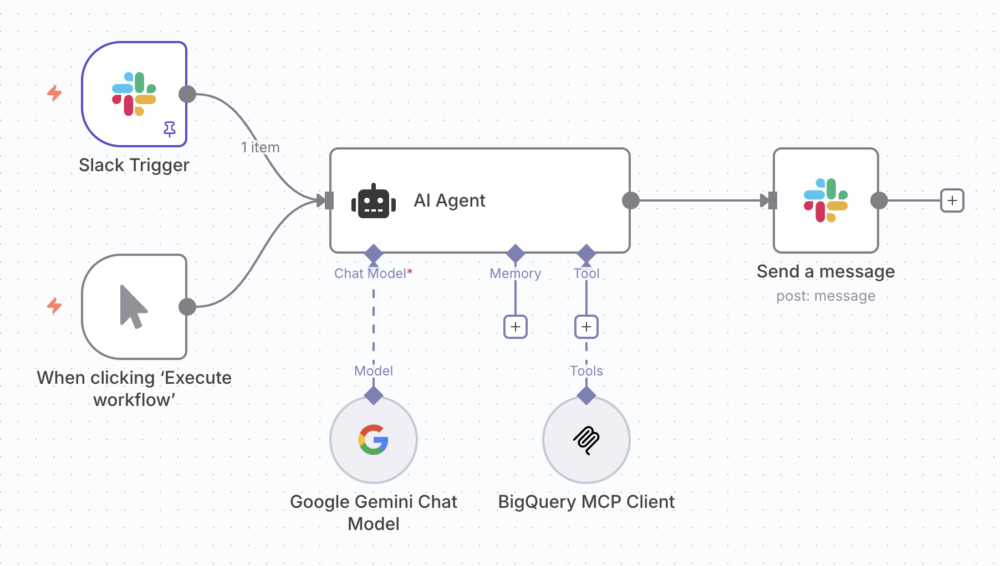

# BigQuery Slack Bot

Connect your team to your marketing, sales, analytics, and other data using natural language in the chat application you already use. This bot puts your team's most common queries directly in their hands in a code-free and secure system.

---

This project demonstrates how to set up a Slack bot with access to BigQuery data. It uses an [n8n](https://n8n.io/) workflow to connect Slack to an [MCP Toolbox](https://github.com/googleapis/genai-toolbox) server, allowing for a secure connection to BigQuery for only the queries you want to allow.

You can run this on a hosted n8n deployment with your MCP Toolbox server on Cloud Run, or you can try it out on a local deployment.

This bot uses the public [`bigquery-public-data.thelook_ecommerce`](https://console.cloud.google.com/marketplace/product/bigquery-public-data/thelook-ecommerce) dataset. You can try it out first and then update it to use your own data.

## Prerequisites

*   A Google Cloud Project with the BigQuery API enabled.
*   An [n8n.io](https://n8n.io/) deployment (cloud or self-hosted).
*   A Slack workspace with permissions to add apps.
*   Configured credentials for Slack in n8n. This can take 15-30 minutes to set up. These resources are helpful:
    *   [Documentation for setup](https://docs.n8n.io/integrations/builtin/credentials/slack/)
    *   [Helpful video guide for setup](https://www.youtube.com/watch?v=222VOwDijz4)

### For a hosted deployment:

*   A Google Cloud Project with access to enable several APIs including the Cloud Run API.
*   [Google Cloud SDK](https://cloud.google.com/sdk/docs/install) installed and configured.

## Workflow Architecture



1.  **Slack Trigger**: Listens for messages directed at the chatbot.
1.  **AI Agent**: Sends the user's request to the AI model and receives a response or tools to use.
1.  **BigQuery MCP Client**: Lists the available tools on top of the BigQuery database and executes the secure, parameterized SQL queries against the data.
1.  **Slack Node**: Sends the results to the user.

## Setup

### 1. Run your MCP Server

Deploy your MCP server to Cloud Run to access it via the internet, or run it locally for a local n8n deployment.

#### Local Deployment

1.  Download the MCP Toolbox for Databases:
    ```bash
    curl -O https://storage.googleapis.com/genai-toolbox/v0.10.0/linux/amd64/toolbox
    chmod +x toolbox
    ```

1.  Launch the server:
    ```bash
    ./toolbox --tools-file "tools.yaml"
    ```

#### Cloud Run Deployment

For more detailed steps, view the [deployment documentation](https://googleapis.github.io/genai-toolbox/how-to/deploy_toolbox/).

1.  Set your project ID:
    ```bash
    export PROJECT_ID="my-project-id"
    ```

1.  Configure gcloud:
    ```bash
    gcloud init
    gcloud config set project $PROJECT_ID
    ```

1.  Ensure all necessary APIs are enabled:
    ```bash
    gcloud services enable run.googleapis.com \
                           cloudbuild.googleapis.com \
                           artifactregistry.googleapis.com \
                           iam.googleapis.com \
                           secretmanager.googleapis.com
    ```

1.  Create a service account to access the MCP server:
    ```bash
    gcloud iam service-accounts create toolbox-identity
    gcloud projects add-iam-policy-binding $PROJECT_ID \
        --member serviceAccount:toolbox-identity@$PROJECT_ID.iam.gserviceaccount.com \
        --role roles/secretmanager.secretAccessor
    gcloud projects add-iam-policy-binding $PROJECT_ID \
        --member serviceAccount:toolbox-identity@$PROJECT_ID.iam.gserviceaccount.com \
        --role roles/bigquery.user
    ```

1.  Put the `tools.yaml` into a secret:
    ```bash
    gcloud secrets create tools --data-file=tools.yaml
    ```

1.  Deploy to Cloud Run:
    ```bash
    export IMAGE=us-central1-docker.pkg.dev/database-toolbox/toolbox/toolbox:latest
    gcloud run deploy toolbox \
        --image $IMAGE \
        --service-account toolbox-identity \
        --region us-central1 \
        --set-secrets "/app/tools.yaml=tools:latest" \
        --args="--tools-file=/app/tools.yaml","--address=0.0.0.0","--port=8080"
    ```

1.  After deployment, the command will output a **Service URL**. Save this URL for the next step.

### 2. Configure the n8n Workflow

1.  Create a new n8n workflow.
1.  Import the `workflow.json` file.
1.  Set your credentials for each node (Slack and your AI model).
1.  In the **BigQuery MCP Client** node, replace `YOUR_MCP_TOOLBOX_URL` with `localhost:5000` for a local deployment or the **Service URL** you copied from the Cloud Run deployment.
1.  Activate the workflow.

## Usage

Invite the bot to a channel in your Slack workspace. Mention the bot and ask it to perform a query. Here are some examples:

**Ask what it can do:**
```
@bigquery_chatbot what can you do?
```

**Single query with parameters:**
```
@bigquery_chatbot show me sales data for January 2024
```

**Complex question requiring multiple queries:**
```
@bigquery_chatbot what were the least profitable categories this year and were they the same as last year?

```

The bot will use the MCP Toolbox server to execute the appropriate queries against the `bigquery-public-data.thelook_ecommerce` dataset and post the results back in the channel.

### Supported Queries and Parameters:

| Query Name | Description | Parameters |
|------------|-------------|------------|
| **Daily New Users** | Counts the number of new user registrations per day, with configurable time range. Returns registration date and daily count of new users, ordered by most recent dates first. | `limit_days` |
| **Monthly Sales** | Retrieves monthly sales data including revenue, order count, and unique customers. Supports filtering by specific year, month, and order statuses. | `year`, `month`, `statuses` (Complete, Processing, Shipped, Cancelled, Returned) |
| **Customer by Country** | Retrieves customer count by country with detailed gender breakdown showing male and female customer counts for each country. This allows you to answer questions about customer demographics by country (e.g., 'How many female customers are in the US?'). | `statuses` (Complete, Processing, Shipped, Cancelled, Returned) |
| **Customer by Gender** | Retrieves customer statistics by gender, including total revenue and quantity sold. Filters out cancelled and returned orders, and allows setting a minimum spend threshold to qualify as a customer. | `min_spend` |
| **Customer by Age** | Segments customers into age groups (Kids <12, Teenagers 12-20, Young Adults 20-30, Adults 30-50, Elderly >50) and counts the number of customers in each group. | `min_spend` |
| **Most Profitable Brands** | Retrieves brands ranked by profitability (revenue and quantity sold). Shows both most and least profitable brands - most profitable appear at the top, least profitable at the bottom. Excludes cancelled and returned orders. | `year`, `month` |
| **Most Profitable Category** | Retrieves product categories ranked by profitability (revenue and quantity sold). Shows both most and least profitable categories - most profitable appear at the top, least profitable at the bottom. Excludes cancelled and returned orders. | `year`, `month` |